# Pokemon CNN

> This project takes Pokemon Sprites and Pokedex entries for classification of diverse pokemon images and fanarts into the 18 Pokemon Types from the series.

---

## Overview

This project uses Pytorch and CNN's to relate the csv textual data of pokemon typing and stats with a prediction based upon Pokemon sprites and photos of the pokemons type. Diverse tecniques where used throughout the project, including Top-k Weights and Grad Cams to understand profoundly the guts of the Neural Network, as if it was actually a brain, a programmed blind organ of relations.

Various google Colabs are added, their main use was experimentation of the properties of CNN, data augmentation and transfer learning over simpler datasets. This allowed us to configure and implement a more solid and perfectly subdivided Colab Notebook in the actual core file for the project:

> Pokemon_cnn.ipynb:
> In Colab: https://drive.google.com/file/d/18nRTXUrehlSubFUJycQzQuBdMICGpBQq/view?usp=sharing

> Pokemon_cnn_Transfer_ver.ipynb
> In Colab: https://colab.research.google.com/drive/10tsXFfKffmpjyQcepBPigJVBESlr_V1B?usp=sharing

## 

## Models

### Classification

1. We made a Classification Problem in which, based on an image, a multiclass CNN with 4 convolutional layers is able to detect the type of a Pokemon.
2. Transfer learning Model with EfficientNet-B2 to solve the same problem.

### Regression

Predicting Pokemon Stats (Atack, Defense, HP etc.) based on their sole image.

---

## Data Preprocessing

### What is a Pokemon

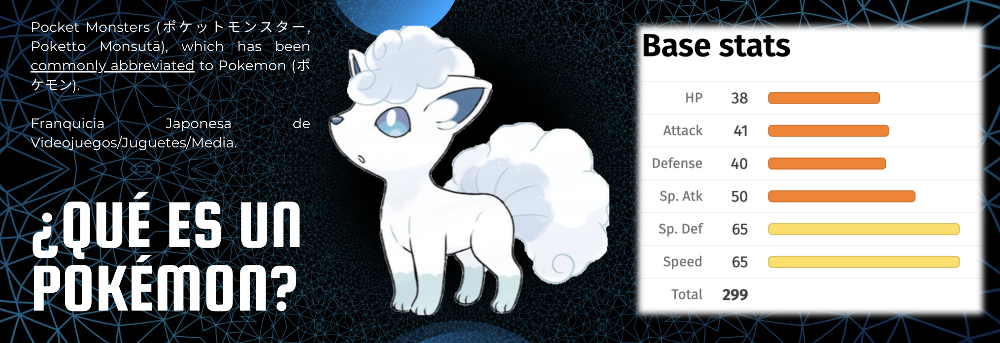

### Dataset Overview

Each Pokemons stats are specified in the pokemon_dataset.csv, which is the equivalent to a Data Science Pokedex, with all the fields and characteristics a Pokemon can have.
Meanwhile, Sprites are inside the Kaggle link (), this is a public image database that can be obtained through Kaggle, although we added a little amount of fanarts to expand the size of the database.

Thus, we are taking the 1025 existing pokemons in the Pokedex till the 10° generation, by the 38 data fields of each Pokemons Pokedex entry and the 4 average images in the sprite database.

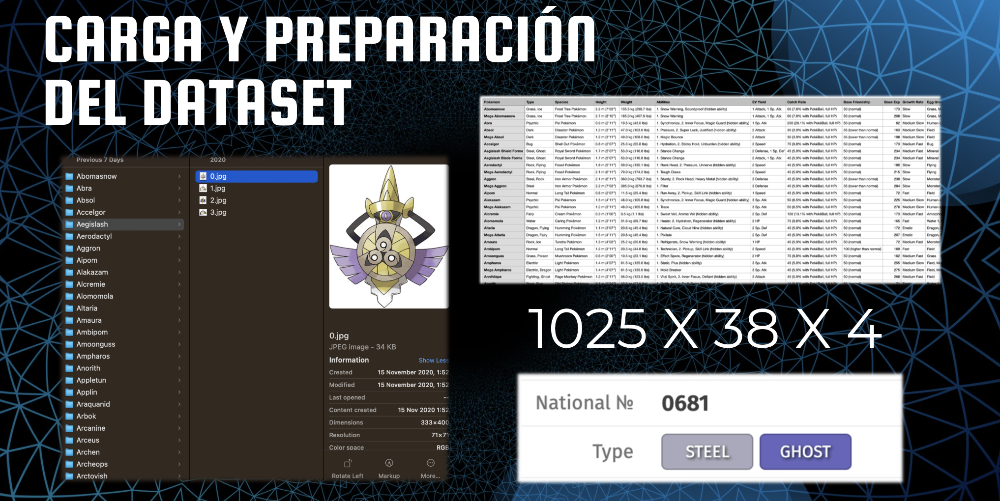

### Dataset Kaggle link

For this project, the dataset “Dataset of 32000 Pokemon Images & CSV, JSON” uploaded by the user “Divyanshu Singh369” on Kaggle in 2023 was used.
(link to the dataset: https://www.kaggle.com/datasets/divyanshusingh369/complete-pokemon-library-32k-images-and-csv
)

For this problem, the objective is to solve a multiclass classification problem, in this case, the type of each Pokémon (Steel, Water, Bug, Dragon, Electric, Ghost, Fire, Fairy, Ice, Fighting, Normal, Grass, Psychic, Rock, Dark, Ground, Poison, and Flying), where the data is close to being evenly distributed across all classes.

The dataset contains 32,000 original data points to train the model, of which we will explore an approximate portion of 3,800, corresponding to the last 3 generations with more advanced graphics from the video game, in order to observe how suitable the development would be with all the data.

Each entry includes a representative image of the Pokémon and an associated database with additional information such as name, type, species, abilities, attacks, attack time, among other attributes. Given the number of data points, after performing the split to train the model, there are 23,040 for training, 2,560 for validation, and 6,400 for testing.

The rest of the experimentation datasets are contained in the common Fashion Mnist and Numeron Kaggle Datasets: https://www.kaggle.com/datasets/zalando-research/fashionmnist

### Data Augmentation

In order to process the Pokemons we made a series of manipulations to concatenate our datasets based on the pokemons name. Also, we performed a series of data augmentations that would allow our model to train and learn under the pressure of different alterations or differentiations over the images. The following is an example result of the Data Augmentation:

## 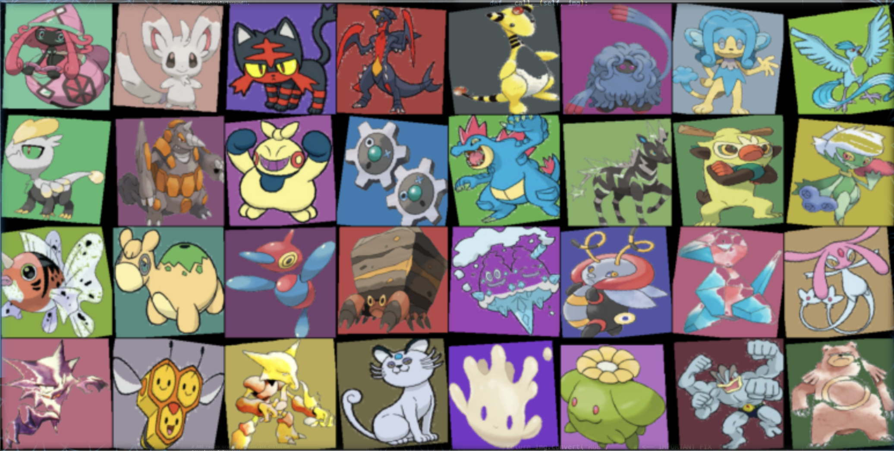

## Regression

### Regression Arquitecture

The models arquitecture is the following:

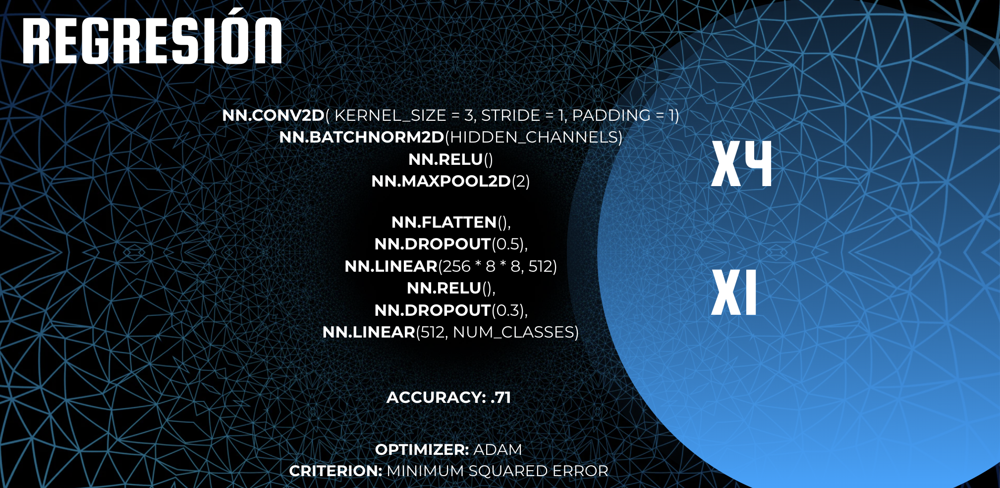

### Regression Results

The models arquitecture is the following:

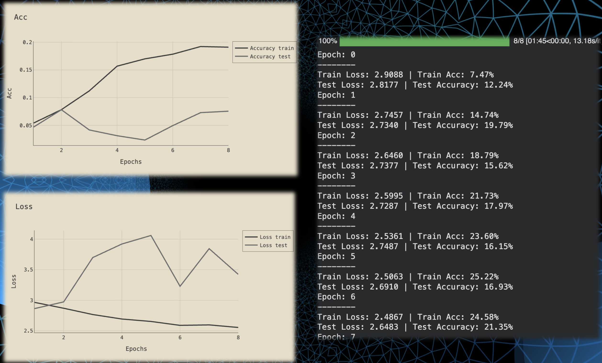
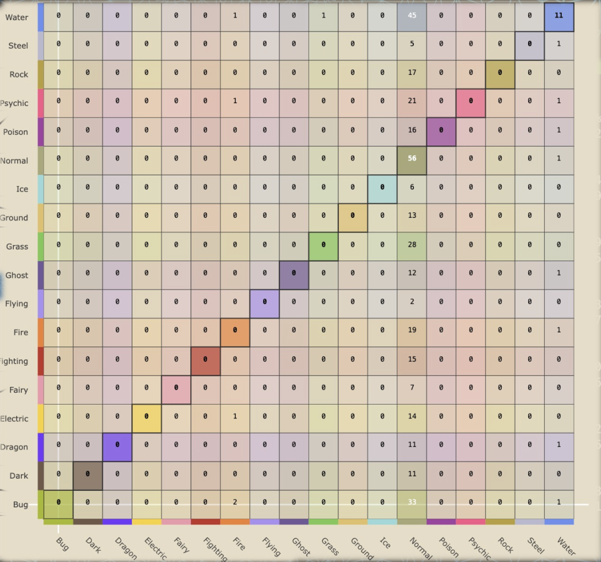

### Explanation Of Fucked Up Results

We vainly tried to relate the appearance of a Pokemon with the stats it has. But, by loosing ourselves over an exploration of the actual Pokedex we found the reason behind our models failure.

1. Firstly, there was a Pokemon inbalance, that is to say, several types where overly represented (v.g. more pokemons of one type than others)
   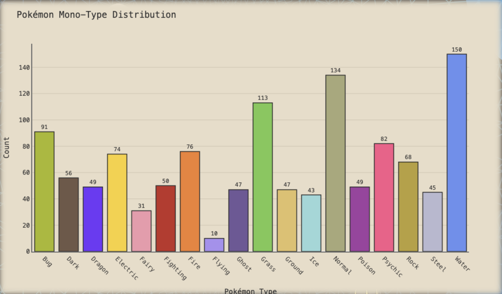

2. Pokemons appearances not necessarily relate to their stats. For example, a famous community case is the following. Onix, a giant rock snake pokemon that possesses sharp angles, high contrast shadows and chunky body should be expected to have a great physical defense and attack stats, yet he doesnt. On the other hand, a Sea Cucumber, that does not measure more than 40 centimeters, with soft shape and round angles, is almost as strong and surpassing greatly the stats of the rock giant. (This would be corrected by appplying a top-k average that balanced our networks weights at the classification moment)
   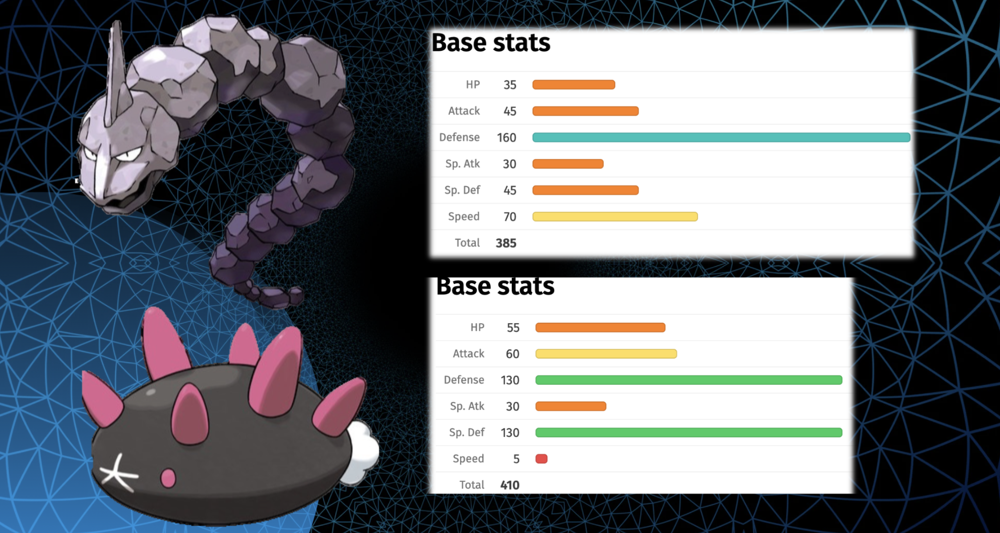

Or lets take the example of the equivalent of a gracious, sharp angled Pokemon God vs. a piece of round Sushi having the same special attack stat.
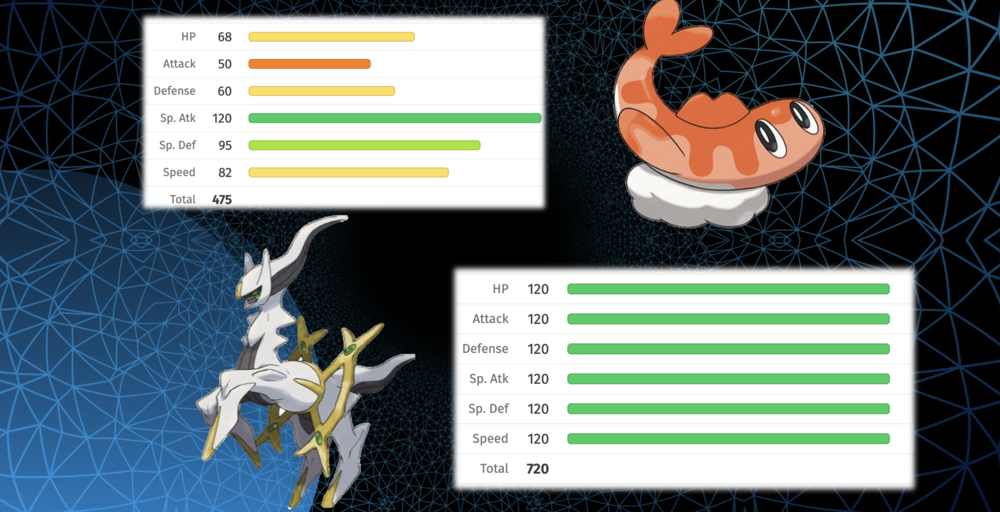

This is a famous characteristic of the pokemon franchise, and even a meme between the community. Sprites, designs, story does not influencely greatly the in game statistics of a Pokemon. And thus we found why our model failed.

But that did not stop us from creating a more advanced model that was able to classify typings as a multiclass CNN, We even supported ourselves in a transfer learning model, yet, we recycled the ideas of the data cleansing, preprocessing and general abstracat flow of database manipulation.

---

## Multi-Class Convolutional Neural Network

### Data Pipeline Improvements

To improve model robustness and prevent overfitting, several other augmentation techniques were applied improving the existing basis. Also by adding a top-k evaluation we were able to balance the classes disparity.
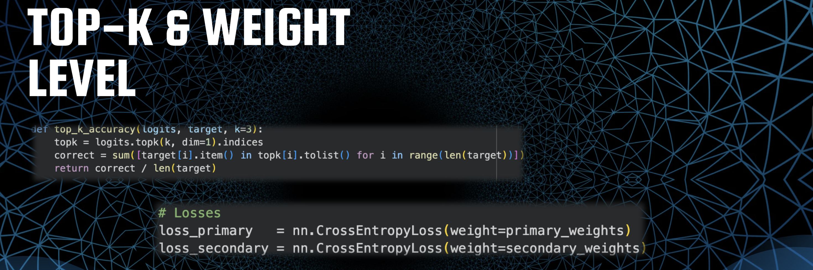

### Transfer & Net Arq

Transfer Learning using the Efficientnet-b2 was implemente over the already stable arquitecture of the multiclass CNN. Yielding an arquitecture that recycles the already existing backbone of the regression model, but adding the transfer part and diverse tweaks such as the optimizer and loss function given the new type of classification problem.

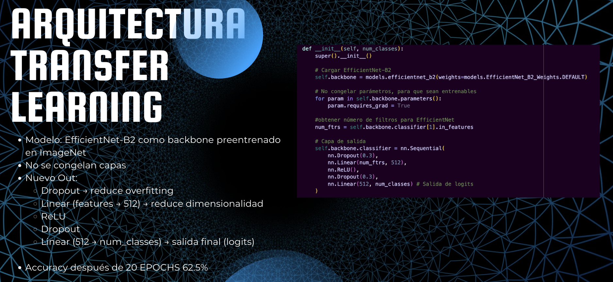
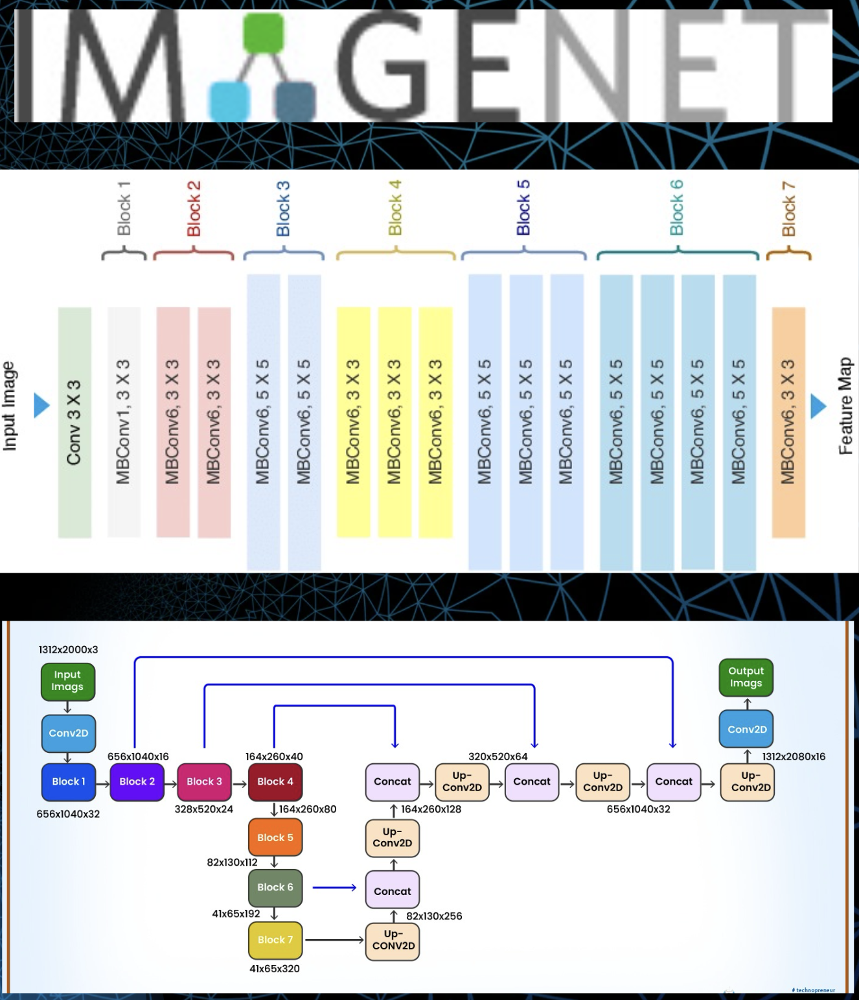

### Multi Class CNN Results

This approach yielded impressively more accute results, showing that our data alligned their peculiarities, forms, and colors, with the actual type of pokemon. A thing that can be recognized easily when looking at sprites and color punctutations or design differentiators.

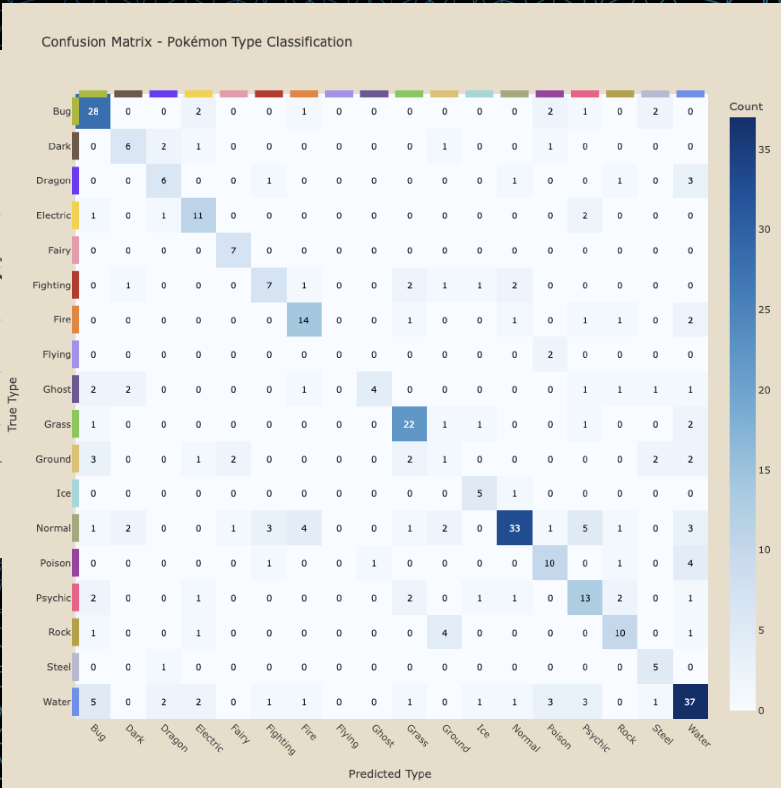

### Grad Cam

We implemente a grad cam as the cherry on top of the cake because we thought that our model was not guiding itself merely though colors, but by forms. For example, searching fins in water pokemons, or highliting wings or some type of symettrical structure around the body for flying types, sharp angles for rock/metal, wavy for ghosts etc.

## 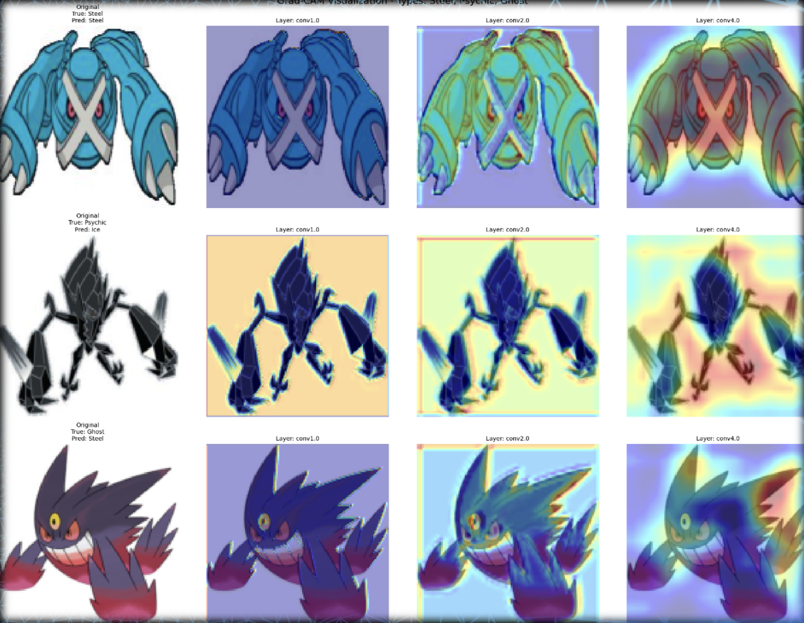

## ▶️ How to Run

Preferably use Colab for the full experience.

```bash
git clone https://github.com/your-username/project-name.git
cd project-name
jupyter notebook notebook.ipynb
```

---

## 📁 Project Structure

```bash
├── Activation_Function_Visualization.ipynb
├── Perceptron_Prediction.ipynb
├── Pokemon_cnn.ipynb
├── Pytorch_MLP_CNN.ipynb
├── README.md
├── Transfer_Learning.ipynb
├── data
│   ├── Pokemon (the one).zip
│   ├── mnist
│   │   ├── fashion-mnist_test.csv
│   │   ├── fashion-mnist_train.csv
│   │   ├── t10k-images-idx3-ubyte
│   │   ├── t10k-labels-idx1-ubyte
│   │   ├── train-images-idx3-ubyte
│   │   └── train-labels-idx1-ubyte
│   ├── mnist.zip
│   ├── numeron
│   │   ├── mnist_test.csv
│   │   └── mnist_train.csv
│   ├── numeron.zip
│   └── pokemon_dataset.csv
├── images
│   ├── Dataset_Overview.png
│   ├── Daugmentation.png
│   ├── Final_Conf_Matrix.png
│   ├── Grad_Cam.png
│   ├── Image_Net.png
│   ├── Monotype_Distro.png
│   ├── PokemonCNN.png
│   ├── PyukuvsOnix.png
│   ├── Reg_model.png
│   ├── Results.png
│   ├── Screenshot 2026-03-21 at 11.26.00 p.m..png
│   ├── SushivsGod.png
│   ├── Topk.png
│   ├── Type_matrix.png
│   ├── What_is_a_pokemon.png
│   └── trasnfer.png
├── pepe.txt
└── pokemon_recon.py
```

---

## Key Takeaways

- Data augmentation significantly improved generalization of the models capacities.
- Transfer learning solidified our models prediction.
- CNN successfully captured spatial, colorful patterns, angles of the images.
- A databases symbolism can exceed the ontology of data itself, realtionships hide because when observing and loosing ourselves in the csv we are only able to see a dimension of the things, but their epistemology does not need a translation. As i would like to put it, rain does not need a translation to be heard, and the deconstruction of data we did, in fact, made is capable of working with it in a subdivided manner, but lost the emergent quality it posseses when actually being something and not just a series of data columns. That is to say, the objects deconstruction can never actually transfer the symbolisms, the actual object in itself, or in other terms: The set is always bigger than its parts.
- Grad-CAM provided interpretability and helped us concatenate the communities knowledge with actual symbolism, color psychology and design construction.

---

## Authors

- Ariz Ortiz
- Diego A. Parra
